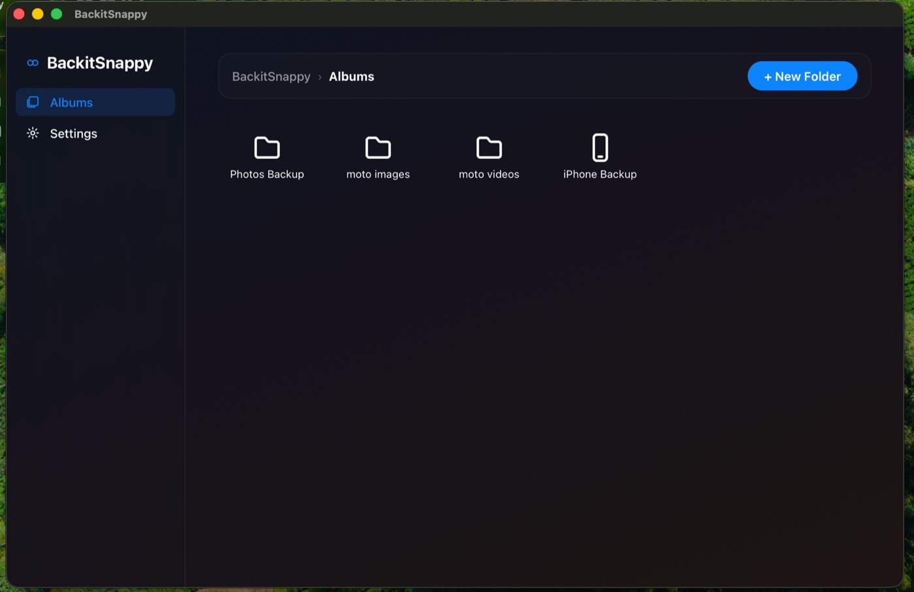
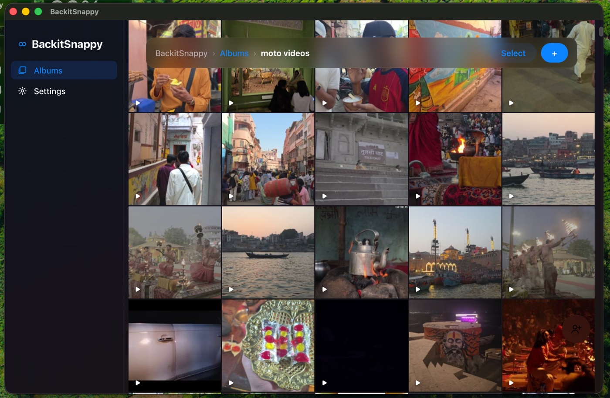
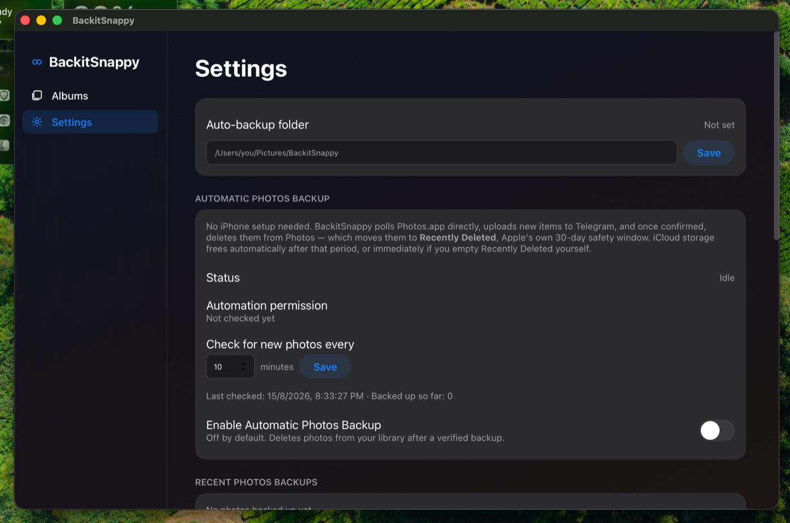

# BackitSnappy

**Unlimited storage for your photos and videos, in their original quality.**

A macOS app that turns your own Telegram account into a personal cloud drive.
No storage tier, no subscription, no re-compression — a 4K video goes up as a
4K video and comes back byte-for-byte identical.



Every install is fully independent — see [Security](#security). Before you back
anything up, note that **the security of everything you store depends entirely
on the security of your Telegram account** — see [Security](#security) for what
that means in practice.

**Docs**: [SETUP.md](SETUP.md) for first-time setup, [USAGE.md](USAGE.md) for
day-to-day use and troubleshooting.

## About

Cloud photo storage keeps getting more expensive, and most of it quietly
downgrades your files — Google Photos' "Storage saver," iCloud's optimized
originals. BackitSnappy takes a different approach: it uses Telegram, a service
you already have a free account on with no meaningful storage cap, as your
backup destination — and always uploads the untouched original.

Your files live in private channels on *your own* Telegram account, not on a
BackitSnappy server. There's nothing centralized to shut down, get breached, or
start charging you later.

See it in more detail on the [landing page](https://prajwalankushrao8.github.io/BackitSnappy-site/).

## What you get

- **Unlimited, original-quality storage.** No tier to outgrow. Files are
  uploaded exactly as they are — no transcoding, no quality tiers, no stripped
  metadata. Per-file size follows your Telegram account: 2GB, or 4GB with
  Telegram Premium, detected automatically after sign-in.
- **Albums that look like Photos.** A real Mac interface over the top, not a
  chat window. Drag files in, browse a proper grid, share an album with another
  Telegram user by username or invite link.
- **Videos stream instantly.** Click a video and it plays immediately, pulled
  from Telegram in chunks as you watch — no waiting for a multi-gigabyte
  download first, and nothing permanently written to your disk.
- **Automatic Photos backup.** Point it at your macOS Photos library and it
  uploads new items on a schedule, then (optionally) removes them from Photos to
  free up iCloud space.
- **Auto-backup folder.** Anything dropped into a watched folder is uploaded
  automatically, including from other apps and scripts.
- **A bounded local footprint.** Your library can be far larger than your Mac's
  disk. Only a capped cache lives locally — set the limit in Settings, and
  least-recently-used files are evicted automatically.

## Setup

**New here? [SETUP.md](SETUP.md) has the full first-time walkthrough**, including
the security setup you should do first. Quick version:

1. **Run the app:**
   ```sh
   ./run.sh
   ```
   This creates the venv and installs dependencies — including a bundled ffmpeg
   for video thumbnails, so there's nothing to install separately — then
   launches BackitSnappy.
2. **Enter your phone number.** This is the first thing the app asks for.
3. **First time on this number?** You'll be asked for a Telegram `api_id` and
   `api_hash` — get them from https://my.telegram.org/apps (there's a button in
   the app that opens it). They're bound to that phone number and remembered, so
   you'll never be asked again for that number.
4. **Enter the login code** Telegram sends you, plus your two-step verification
   password if you have one set.
5. A private "BackitSnappy Storage" channel is created automatically on your
   Telegram account, and any albums you already had are discovered and indexed.

A short, skippable welcome tour walks through Albums and Settings on first
launch. Replay it from **Settings → Help → Replay welcome tour**.

## Albums



Create an album in the **Albums** tab, drag files into it, and invite another
Telegram user by username. If Telegram's privacy settings block a direct invite
(common for accounts that haven't messaged you before), BackitSnappy falls back
to a shareable invite link automatically.

Each album opens into a Photos.app-style grid. Click any item to view it
full-size, download it, or delete it. Videos start playing immediately by
streaming from Telegram rather than downloading first.

## Automatic Photos backup



In **Settings → Automatic Photos Backup**, turn it on and BackitSnappy will poll
your macOS Photos library on a schedule (default: every 10 minutes), upload
anything new, and — only after the upload is confirmed — delete it from Photos.

Deleted items go to Photos' own **Recently Deleted**, Apple's 30-day safety
window, so nothing is ever destroyed immediately. iCloud storage frees up after
that window, or right away if you empty Recently Deleted yourself.

This is **off by default** and requires macOS Automation permission for
Photos.app, which the system will prompt for the first time it runs.

> **macOS will ask you to confirm.** Deleting goes through PhotoKit, and macOS
> shows a confirmation dialog for it that can't be suppressed. BackitSnappy
> batches a whole cycle into a single request, so it's **one dialog per cycle**,
> not one per photo — but it does mean the feature needs you at the machine to
> approve. Decline it and everything simply stays in your library, still backed
> up.

## Auto-backup from a folder

In **Settings**, set an "Auto-backup folder" (e.g. `~/Pictures/BackitSnappy`).
Any file added to it — including in subfolders, watched recursively — uploads
automatically. It uses real file-system events rather than polling, and waits
until a file has finished writing before uploading, so it never grabs a
half-copied file.

Useful for more than manual drops: point it at wherever another app already
saves things — a screenshot folder, a scanner's output, an export folder — and
everything that appears there is backed up.

## Local disk usage

Telegram holds the full library; your Mac only keeps a cache. **Settings** shows
current usage broken down by database, thumbnails, and cached media, and lets
you set a maximum cache size. When the cache exceeds it, least-recently-used
files are evicted — they re-download on demand the next time you open them.

## Security

> **The security of everything you back up depends entirely on the security of
> your Telegram account.** BackitSnappy doesn't hold your data — it uploads to
> private channels on *your own* Telegram account, with no separate BackitSnappy
> password or server in between. Anyone who can get into your Telegram account
> can see everything you've backed up. Turn on
> [Two-Step Verification](https://telegram.org/faq#two-step-verification) in
> Telegram before relying on this — see [SETUP.md](SETUP.md#before-you-start-read-this).

- **Every install is fully independent.** Your own Telegram session, your own
  local database. Nothing is shared or centralized between users of this
  project.
- The local API binds to `127.0.0.1` only — never your LAN or `0.0.0.0` — and
  rejects requests whose `Host` header isn't a loopback name, which closes DNS
  rebinding.
- Every API request requires the `X-Pairing-Token` header. The token is handed
  to the UI over an in-process bridge and never travels the network; it rotates
  on logout.
- Your Telegram session, API credentials, and pairing token live in the macOS
  Keychain, never on disk in plaintext. The local index database is `0600`.
- Untrusted filenames — a Telegram filename is chosen by whoever uploaded the
  file — are normalized before being used as a path, and escaped before being
  rendered.
- Logging out never deletes your local index. Signing back in with the same
  number resumes instantly; signing in with a *different* account resets
  account-scoped settings so auto-upload can never silently carry over.

A full source audit of v0.2.0, including the findings fixed in it, is
summarized in [CHANGELOG.md](CHANGELOG.md#security).

## License

AGPL-3.0 — see [LICENSE](LICENSE).
