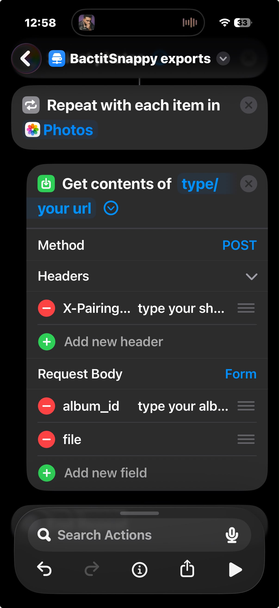

# First-time setup

A complete walkthrough for getting BackitSnappy running for the first time.
For a quick reference once you're already set up, see the main
[README](README.md).

## Before you start: read this

**The security of everything you back up depends entirely on the security
of your Telegram account.**

BackitSnappy doesn't store your photos and videos itself — it uploads them
to private channels on *your own Telegram account*. There's no separate
BackitSnappy password, no separate BackitSnappy server holding your data.
Whoever can get into your Telegram account can see everything you've backed
up. That means:

- **Turn on Telegram's Two-Step Verification** (Telegram app → Settings →
  Privacy and Security → Two-Step Verification) if you haven't already. This
  is the single most effective thing you can do — it means your login code
  alone isn't enough for someone else to get in.
- **Use a strong, unique password** for that Two-Step Verification — not
  one reused from another account.
- **Watch for phishing.** Telegram will never ask for your login code
  outside the Telegram app itself. If a website or message asks you to type
  your code in, it's not really Telegram.
- **Periodically check Active Sessions** (Settings → Devices in the
  Telegram app) and log out anything you don't recognize.
- This app's own local pieces (the Keychain-stored session/credentials, the
  pairing token, the Tailscale-only network listener) are all designed to
  keep your *Mac* secure — but none of that matters if your underlying
  Telegram account itself is compromised. Telegram account security is the
  actual foundation everything else sits on.

With that said, here's how to get set up.

## 1. Prerequisites

- A Mac running macOS.
- Python 3 (from [python.org](https://python.org) or Homebrew, if you don't
  already have it).

That's it — `run.sh` handles the rest, including ffmpeg (used for video
thumbnails), which is installed automatically as a Python dependency. No
separate `brew install` step needed.

## 2. Get Telegram API credentials (one-time, every Telegram app needs this)

1. Go to https://my.telegram.org/apps (or use the "Open my.telegram.org/apps"
   button that appears in the app's own setup screen in step 4 below — same
   link, whichever's easier).
2. Log in with your phone number and the code Telegram sends you.
3. Fill in "App title" and "Short name" with anything you like (e.g.
   "BackitSnappy") — the rest of the form can be left as defaults.
4. You'll be shown an `api_id` (a number) and an `api_hash` (a long string of
   letters/numbers). Keep this page open, or copy both values somewhere —
   you'll paste them into BackitSnappy in a minute.

This is a one-time step tied to your Telegram account, not something you'll
need to repeat.

## 3. Run the app

```sh
git clone https://github.com/PrajwalAnkushrao8/BackitSnappy.git
cd BackitSnappy
./run.sh
```

This creates a Python virtual environment, installs dependencies, and
launches the app. It'll open its own window — this isn't a website, nothing
here needs a browser.

## 4. First-launch wizard

1. **Connect Telegram** — paste in the `api_id` and `api_hash` from step 2.
2. **Sign in** — enter your phone number, with country code (e.g.
   `+15551234567`).
3. **Enter code** — Telegram sends the login code as a message *inside the
   Telegram app itself* (usually to a device you're already signed into),
   not as a text message. Check there.
4. **Two-step verification** — only shown if you have it enabled (you
   should!). Enter that password.

Your session is saved to the macOS Keychain after this — you won't need to
sign in again on future launches, unless you manually log the session out
from Telegram itself (see [README's session-recovery notes](README.md) if
that happens — nothing is lost, you just sign back in).

## 5. What happens automatically after you sign in

- A private **"BackitSnappy Storage"** channel is created on your Telegram
  account — this is where general backups (not in any specific album) land.
- A private **"iPhone Backup"** album is created — a stable, dedicated
  destination for your iPhone Shortcut to upload into (see step 7).
- A short, skippable **welcome tour** walks through the Albums tab and
  Settings. Replay it anytime from Settings → Help.

## 6. Set up Mac auto-backup (optional)

Point BackitSnappy at a folder once, and never think about backing that
folder up again. In **Settings**, set an "Auto-backup folder" (e.g.
`~/Pictures/BackitSnappy`) — any file added to it, or any of its
subfolders, uploads automatically once it's finished writing to disk. No
dragging into the app required.

This works well for more than manual drops, too: point it at wherever
another app or script already saves files (a screenshots folder, a
scanner's output, an export folder), and everything that lands there gets
backed up on its own.

## 7. Set up iPhone auto-backup (optional)

> **Photos only, not videos.** The Shortcut reliably backs up photos.
> Video files consistently fail to attach through iOS Shortcuts' photo
> picker — this turned out to be a genuine platform limitation, not a
> configuration problem (several different approaches were tried). For
> videos, connect your iPhone to your Mac and drag the video into an album
> directly in the app instead — that path always works. See
> [Troubleshooting](USAGE.md#troubleshooting) for the full story.

### 7a. Install and sign in to Tailscale on your Mac

1. Download Tailscale from [tailscale.com/download](https://tailscale.com/download)
   (or the Mac App Store).
2. Open it — it adds a small icon to your menu bar.
3. Click the menu bar icon → **Log In**. This opens your browser to sign in
   (Google, Microsoft, GitHub, email, or passkey all work).
4. Once signed in, the menu bar icon should show your Mac as **Connected**.

### 7b. Install and sign in to Tailscale on your iPhone

1. Install **Tailscale** from the App Store.
2. Open it and tap **Get Started** / **Log In**.
3. Sign in with **the exact same account** you used on your Mac — this is
   what puts both devices on the same private network (your "tailnet").
4. iOS will ask permission to add a VPN configuration — this is expected
   and required; allow it.
5. Confirm it shows **Connected** in the app.

To double check both devices are actually on the same tailnet: open
Tailscale on either one and look at its device list — your Mac and iPhone
should both appear there, each with a `100.x.x.x` address.

### 7c. Turn on Tailscale access in BackitSnappy

In **Settings**, turn on "Allow uploads over Tailscale," then restart the
app (a one-time requirement after toggling this).

### 7d. Get your Shortcut's setup values

Open **Settings → iOS Shortcut setup** — it shows everything the Shortcut
needs, each with a Copy button: the **Upload URL** (auto-detected from your
Mac's current Tailscale IP), your **Pairing Token**, and the **iPhone
Backup Album ID**.

### 7e. Import and set up the Shortcut

1. On your iPhone, open the import link:
   **https://www.icloud.com/shortcuts/b3be88afbd744f04af957115e89c9ca7**
   and tap **Add Shortcut** in the Shortcuts app.
2. **Before running it the first time, edit it** to fill in your own
   values — the imported Shortcut ships with placeholder text, not a live
   prompt, so this is a one-time manual edit, not something it asks you for
   automatically:

   

   - Tap the URL field (showing `type/ your url`) and replace it with the
     **Upload URL** from Settings → iOS Shortcut setup (step 7d).
   - Tap the `X-Pairing-Token` header value (showing `type your sh...`) and
     replace it with your **Pairing Token**.
   - Tap the `album_id` field (showing `type your alb...`) and replace it
     with your **iPhone Backup Album ID**.
   - Leave `file` as-is — it's already correctly bound to the photo you
     select.
3. These values are saved as part of the Shortcut once you set them — you
   won't need to re-edit it on every run. You *will* need to update it again
   if you ever rotate your pairing token, or if your Mac's Tailscale IP
   changes and Settings shows a different Upload URL after hitting
   "Refresh."
4. Run it by opening the Shortcuts app and tapping it, adding it to your
   Home Screen as its own icon for one-tap access, or (if you name it
   something recognizable) triggering it by voice via Siri.
5. It selects photo(s) via the Photos picker — make sure **Settings →
   Privacy & Security → Photos → Shortcuts** is set to **Full Access** first,
   or the picker can silently fail to hand over what you selected.
6. There's no progress bar on the phone itself — it's a background upload.
   Check the **Albums → iPhone Backup** folder in the app afterward to
   confirm things arrived, or watch for the "keeping your Mac awake"
   notification, which confirms an upload is actively in progress.

## You're done

At this point BackitSnappy is fully set up: Telegram connected, your Storage
channel and iPhone Backup album created, and (if you set them up) both
auto-backup paths running. Everything from here is day-to-day use — see
[USAGE.md](USAGE.md) for how Albums, sharing, downloads, and sync actually
work, plus a troubleshooting section for common iOS Shortcut issues.
